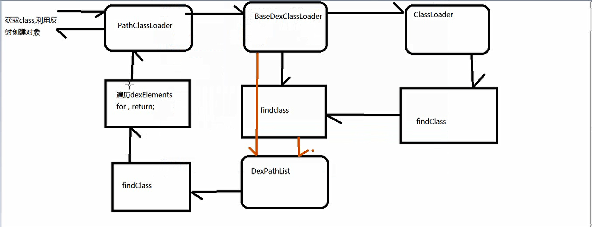
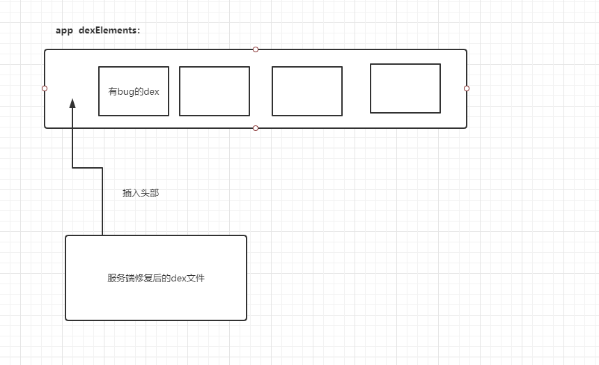

# 1.热修复

#### 依赖引入： 
implementation 'com.alipay.euler:andfix:0.5.0@aar'

#### 热修复相关：
1.旧包-新包-》得到差分包, fix.apatch;
2.热修复时机：每次启动app，或者定时校验差分包；

#### 注意点：
1.尽量不要multidex， 命名尽量不要混淆
2.差分包一定要在加固包之前去生成。
3.是修复方法，但不能增加成员变量，也不能新增方法


#### 压缩图片：
1.NDK
2.传统使用BitmapFactory压缩

#### Activity启动流程

总：startActivity->检查->启动

startActivity的时候可以设置请求requestCode
1.startActivity->2.startActivityForResult->3.Instrumentation.execStartActivity->3.ActivityTaskManager.getService().startActivity->4.通过binder调用AMS服务的startActivity方法->5.ActivityThread.performLaunchActivity

##### 1.performLaunchActivity方法：

```java
activity = mInstrumentation.newActivity(
                    cl, component.getClassName(), r.intent);
```

```java
// cl是ClassLoader 通过类加载器从dex文件加载目标Actvity，然后通过反射newInstance()实例化对象
return (Activity) cl.loadClass(className).newInstance();
```

##### 2.ClassLoader:

```java
// 继承关系
PathClassLoader->BaseDexClassLoader->ClassLoader
```
```java
// ClassLoader.loadClass方法
protected Class<?> loadClass(String name, boolean resolve)
        throws ClassNotFoundException
    {
            // First, check if the class has already been loaded
            // 查找是否已加载过
            Class<?> c = findLoadedClass(name);
            if (c == null) {
                try {
                    if (parent != null) {
                    	// 没有加载过，调用父加载器加载
                        c = parent.loadClass(name, false);
                    } else {
                        c = findBootstrapClassOrNull(name);
                    }
                } catch (ClassNotFoundException e) {
                    // ClassNotFoundException thrown if class not found
                    // from the non-null parent class loader
                }

                if (c == null) {
                    // If still not found, then invoke findClass in order
                    // to find the class.
                    c = findClass(name);
                }
            }
            return c;
    }

```

##### 3.类的加载机制流程：



```java
// DexPathList对象
public Class<?> findClass(String name, List<Throwable> suppressed) {
        for (Element element : dexElements) {
            Class<?> clazz = element.findClass(name, definingContext, suppressed);
            // 遍历，一查找到就返回。 利用这个特点，如果我们有修复后的dex，app下载后，可以插入到                   // dexEelment数组的头部，实现修复bug。
            if (clazz != null) {
                return clazz;
            }
        }

        if (dexElementsSuppressedExceptions != null) {
            suppressed.addAll(Arrays.asList(dexElementsSuppressedExceptions));
        }
        return null;
    }
```
#### dex修复过程：

1.系统的dex目录：dexDir = context.getDir("odex", Context.MODE_PRIVATE);

2.服务端dex文件保存到系统能够访问的dex目录下

3.创建修复文件fixDexFile的ClassLoader，拿到dexElements数组

4.合并app的dexElements和服务端的dexElements组数。

另外：每次Application启动都要再次调用loadFixDex（）方法，因为要加载之前修复过的dex，之前是把dex拷贝到odex目录，每次启动还是要加载修复的dex的ClassLoader的，也就是走上面的3、4步骤。

详情见BaseLibrary.fixbug.FixDexManager类




开发细节：

1.可以把出错的class重新打成一个fix.dex, 不太可取，除非不混淆。

2.分包   把不会出错的分到主dex， 其他留在从dex。

3.直接下载整个dex包，进行插入修复，问题dex可能比较大，影响启动速度。


由于是导入整个包的dex， 所以是可以增加方法，增加类，增加变量，但不能增加资源。

总结： 类都是通过PathDexClassLoader加载的


# 2.通用Dialog
## AlerDialog分析

## builder设计模式
将对象的构建和表示分离。


# 3.插件化

#### 案例：

点击按钮，从服务端下载apk，保存到内存，可跳转并传递参数。

#### 问题：

1.启动的插件Activity，是没有被注册的。 （解决：绕AndroidManifest检测）

2.类需要加载，插件的Activity类在插件中。

3.还需要加载资源。


没注册的Activity报错，用一个注册的ProxyActivity占坑，


